# trevors-backend-e-commerce  
  

## Description  
Set up the backend for an e-commerce website to communicate with a MySQL database.  

## Table of Contents  
* [Installation](#installation)  
* [Usage](#usage)  
* [Credits](#usage)  
* [License](#license)    
* [Questions](#questions)

## Installation  
To install necessary dependencies, run the following command:  

```  
npm install  
```  

## Usage  
To run the program type npm start in your console while in the base route of the directory.  Open up insomnia afterwards.  You will then be able to create a get, post, put, and delete requests with the paths of /api/products, /api/categories, or /api/tags.  
Walkthrough Video:  
https://drive.google.com/file/d/1aM4NG54rEwbSx7rJoOPpXOoviOsqrXHl/view?usp=sharing   
Examples of a get, post, put, and delete requests:  
tags, get requests:  
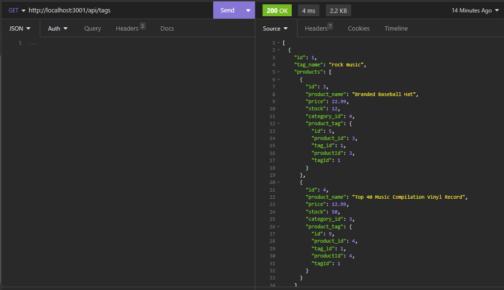  
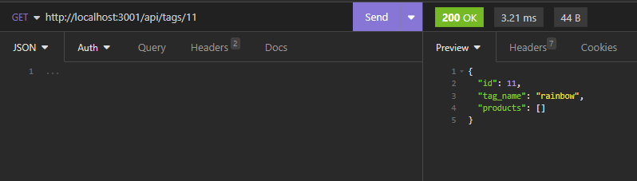  
tags, post requests:  
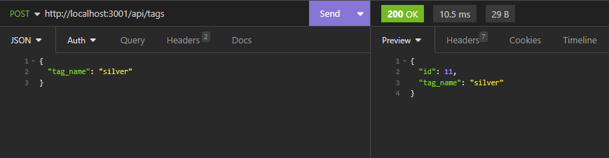  
tags, put requests:  
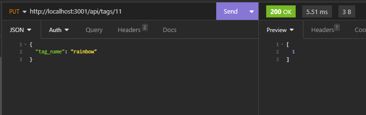  
tags, delete requests:  
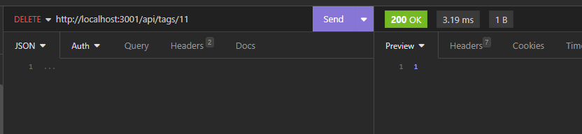  
categories, get requests:  
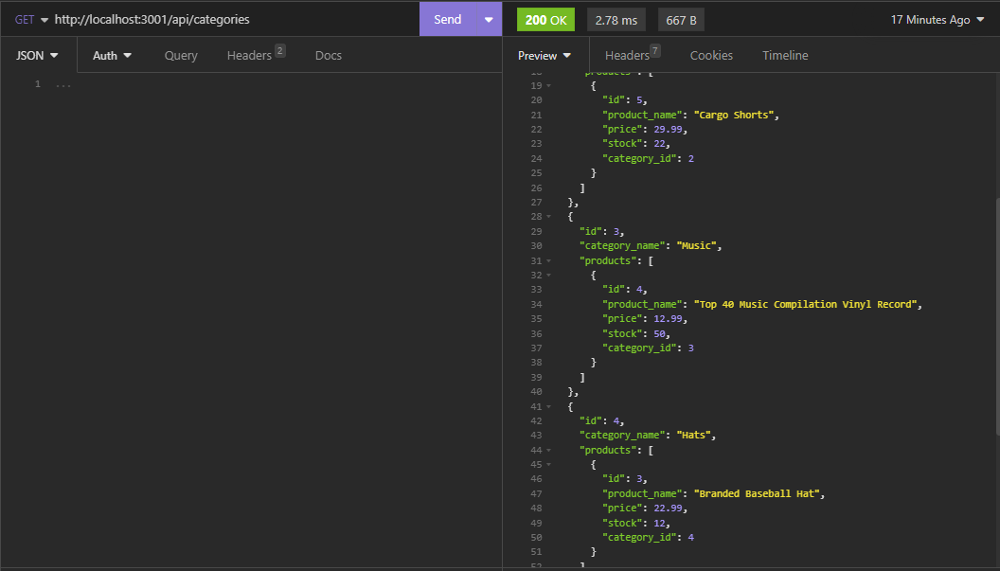  
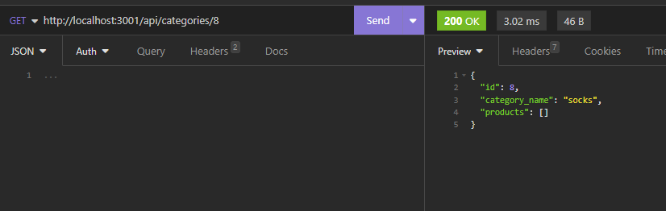  
categories, post requests:  
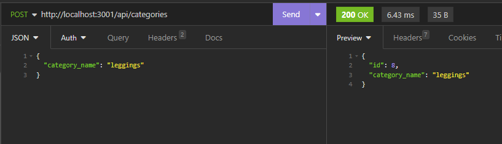  
categories, put requests:  
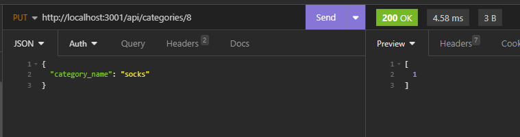  
categories, delete requests:  
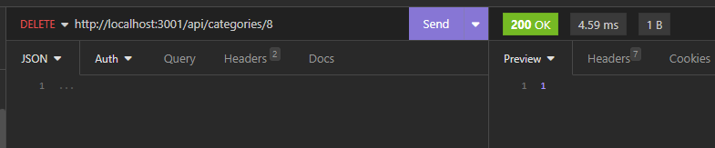  
products, get requests:  
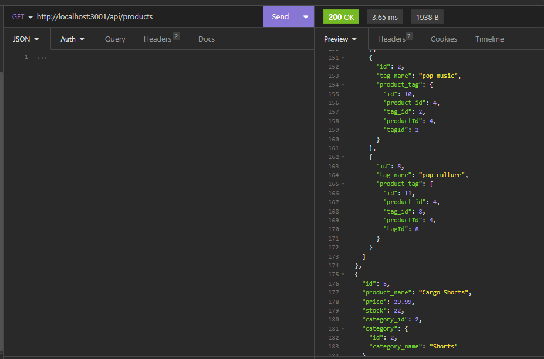  
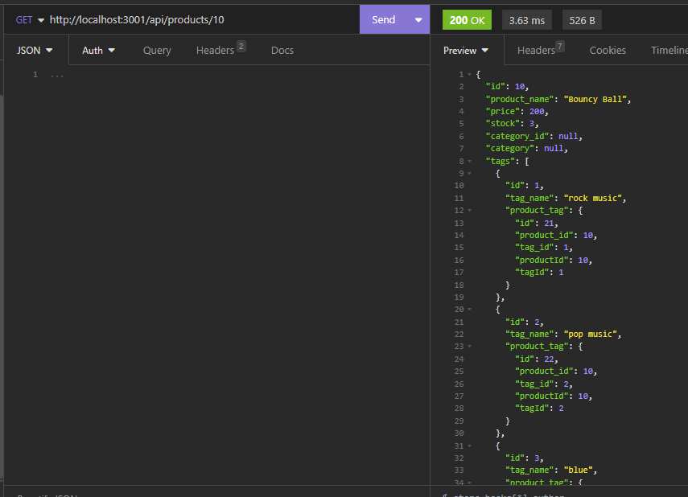  
products, post requests:  
  
products, put requests:  
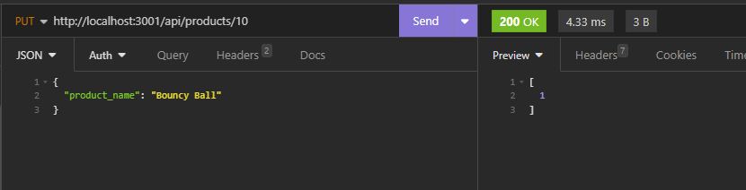  
products, delete requests:  
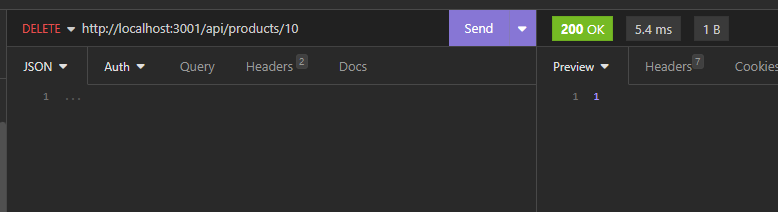  

## Credits  
Created by: Trevor Blanchard  
Original file location: https://github.com/coding-boot-camp/fantastic-umbrella  
Link to repo: https://github.com/blanchardt/trevors-backend-e-commerce   

## License  
This project is licensed under the MIT license.  

## Questions  
If you have any questions about the repo, open an issue or contact me directly at blanchardt@merrimack.edu.  You can find more of my work at [blanchardt](https://github.com/blanchardt/).  